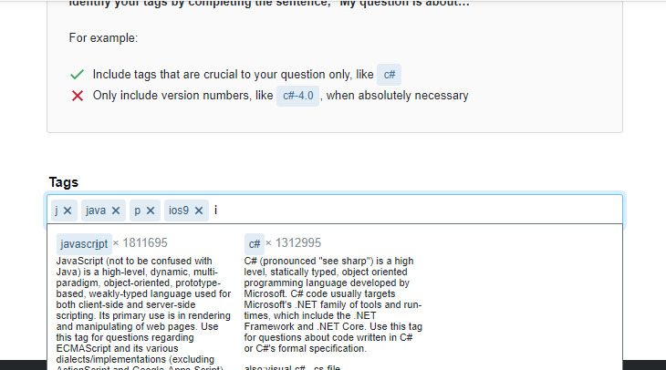
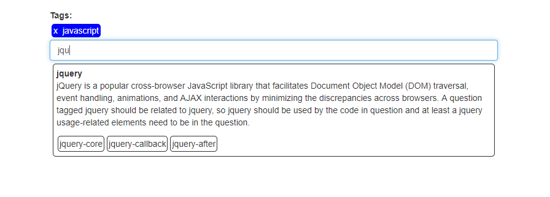

I tried to implement the front end dynamic tag processing feature from stackoverflow using vanilla Javascript ES6, HTML5 & CSS3, as shown below:

And here below is what i came up with:

I will be glad to get your feedbacks: didagou@gmail.com